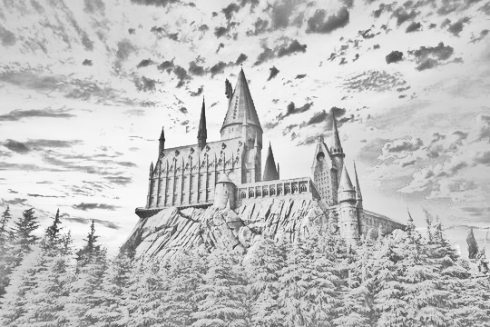

# 🎨 **Artograph: Image to Sketch Converter**

Artograph is a Python-powered project that converts any RGB image into a realistic pencil sketch using advanced image processing techniques. It now features a **web-based interface** to make the process easier and more accessible. 🚀

---

## 📚 **Why Choose Artograph?**
- 🖼️ **Instant Conversion:** Quickly transform your image into a high-quality pencil sketch.
- 🌐 **Web-Based Interface:** No coding required! Simply upload your image and download the sketch.
- 🎨 **Fine Details with Smooth Effects:** Gaussian blur and color dodge techniques ensure stunning results.
- 💾 **Supports Multiple Formats:** Works with JPG, PNG, and JPEG files.
- ⚡ **Fast and Lightweight:** Optimized performance using OpenCV and NumPy.

---

## 🚀 **How to Get Started**
Ready to create stunning sketches? Follow these steps:

---

### 1️⃣ **Clone the Repository**
```bash
git clone https://github.com/officialayushyadav15/artograph.git
cd artograph
```

---

### 2️⃣ **Install Required Libraries**
Ensure all dependencies are installed by running:
```bash
pip install -r requirements.txt
```

---

### 3️⃣ **Launch the Web Interface**
Run the Flask application to open the web interface:
```bash
python app.py
```
💡 Open your browser and go to:
```
http://127.0.0.1:5000
```

---

### 4️⃣ **Convert an Image via Script (Optional)**
Prefer using the script instead of the web interface? Run:
```bash
python sketch.py
```
✅ The sketch will be saved as `final_sketch.jpeg` in the `/static/images/` folder.

---

## 🎥 **Watch Artograph in Action!**
Check out how the web interface works in this quick demo:


https://github.com/user-attachments/assets/db68628a-fc6b-4416-b5e8-c154da33f9d0


---

## 📝 **How It Works**
Here’s a breakdown of the image-to-sketch conversion process:

1. 🎯 **Load RGB Image:** Reads the original image.
2. ⚫ **Convert to Grayscale:** Converts the image to grayscale.
3. 🔁 **Create Negative Image:** Inverts the grayscale to create a negative.
4. 🌫️ **Apply Gaussian Blur:** Smooths the negative with Gaussian blur.
5. 🎨 **Color Dodge Blending:** Combines the grayscale with the blurred negative to generate the sketch.
6. 💾 **Save Output:** Saves the final sketch as `final_sketch.jpeg`.

---

## 🌐 **Web Interface Highlights**
- 📤 **Upload Image:** Supports JPG, PNG, and JPEG.
- 🎨 **Sketch Preview:** View your sketch instantly.
- 📥 **Download Sketch:** Download the generated sketch with a single click.

---

## 📸 **Sample Output**
| Original Image       | Sketch Output         |
|---------------------|-----------------------|
|  |  |

---

## 🧩 **Customization Options**
Make the sketch look just the way you want! 🎨

- ✏️ **Change Input File:** Edit the image path in `sketch.py` or upload via the web interface.
- 🌫️ **Adjust Blur Intensity:** Modify the Gaussian blur parameters to control the smoothness.
- ⚡ **Tune Color Dodge Effect:** Fine-tune the blending values in the `convert()` function.

---

## ⚡️ **Troubleshooting Tips**
Stuck? Check out these solutions:

- 📝 **File Not Found:** Ensure the image path is correct.
- 🔌 **Port Conflict:** If port `5000` is in use, change it in `app.py`:
```python
app.run(host='0.0.0.0', port=8080)
```
- 📦 **Dependency Issues:** Reinstall required packages:
```bash
pip install -r requirements.txt
```

---

## 📧 **Contact & Support**
Got questions or suggestions? Reach out! 😊
- GitHub: [officialayushyadav15](https://github.com/officialayushyadav15)


